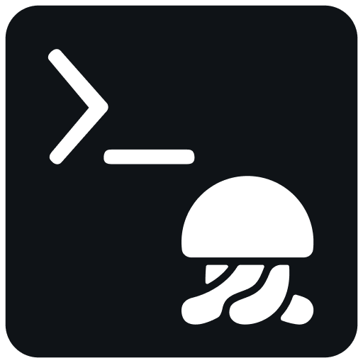

<h1>
  
  Iru Control
</h1>

`iructl` is a utility for managing resources via the Iru API.

## Features

- Create and sync a local repository of custom profiles, scripts, or apps with your Iru tenant
- Import existing profiles, scripts, and app installers without copy/pasting
- List or show details of local and remote resources directly from the command line
- Format output as structured YAML, plist, or JSON for use with other tools
- Declaratively assign resources to Blueprints with `ensure_blueprints` (experimental preview)
- Build your own integration for managing custom resources with a fully featured Python client module

## Installation

Install with **one** of the following:

```sh
# Homebrew
brew tap kandji-inc/iructl https://github.com/kandji-inc/iructl.git
brew install iructl

# uv
uv tool install iructl

# pipx
pipx install iructl
```

See the [Installation](https://github.com/kandji-inc/iructl/wiki/Installation) wiki page for prerequisites and details.

## Quick Start

Follow the steps below to quickly get up and running with a local copy of your Iru Custom Resources.

1. Create a new local repository: `iructl new my-repo`
2. Change directories: `cd my-repo`
3. Set your credentials:
    1. `export IRUCTL_TENANT=<YOUR_API_URL_HERE>`
    2. `export IRUCTL_TOKEN=<YOUR_API_TOKEN_HERE>`
4. Download your custom profiles from Iru: `iructl profile pull --all`
5. Download your custom scripts from Iru: `iructl script pull --all`
6. Download your custom apps and their installers from Iru: `iructl app pull --all --download`

> [!NOTE]
> Replace `<YOUR_API_URL_HERE>` and `<YOUR_API_TOKEN_HERE>` with your API URL and token. See
> [Configuration](https://github.com/kandji-inc/iructl/wiki/Configuration) for authentication details.

## Getting Help

Each command and subcommand has its own help screen, accessed by appending `--help` (e.g., `iructl --help`,
`iructl new --help`).

Full documentation lives in the [iructl wiki](https://github.com/kandji-inc/iructl/wiki). Key pages:

- [Getting Started](https://github.com/kandji-inc/iructl/wiki/Getting-Started)
- [Populating Your Local Repository](https://github.com/kandji-inc/iructl/wiki/Populating-Your-Local-Repository)
- [Configuration](https://github.com/kandji-inc/iructl/wiki/Configuration)
- [Pushing and Syncing](https://github.com/kandji-inc/iructl/wiki/Pushing-and-Syncing)
- [Custom Profiles](https://github.com/kandji-inc/iructl/wiki/Custom-Profiles)
- [Custom Scripts](https://github.com/kandji-inc/iructl/wiki/Custom-Scripts)
- [Custom Apps](https://github.com/kandji-inc/iructl/wiki/Custom-Apps)

## License

See [LICENSE](LICENSE).
